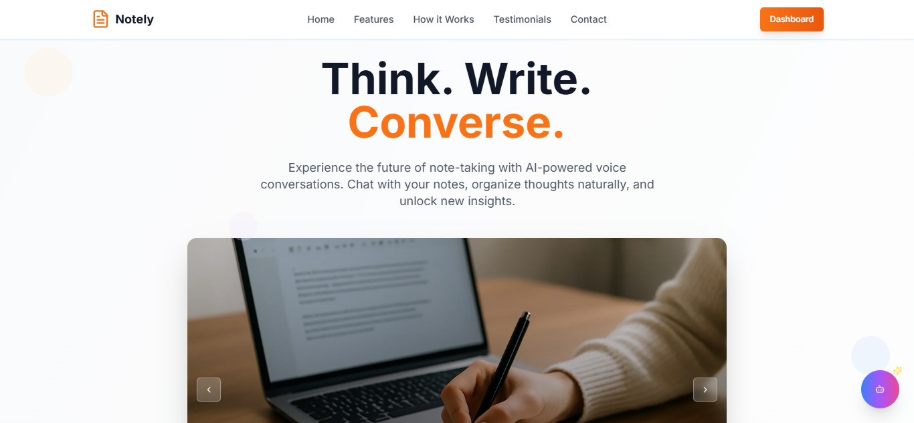
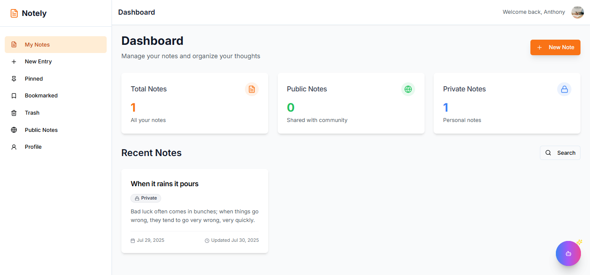

# 📝 Notely - Smart Note-Taking with AI Voice Assistant



## 🌟 About Notely

Notely is a modern, AI-powered note-taking application that revolutionizes how you create, organize, and interact with your notes. Built with cutting-edge technologies, Notely combines the simplicity of traditional note-taking with the power of artificial intelligence and voice interaction.

### ✨ Key Features

- **🎙️ Voice Chat with Your Notes**: Interact with your notes using natural voice commands powered by advanced AI
- **📝 Rich Text Editor**: Create beautifully formatted notes with markdown support, highlighting, and media embedding
- **🤖 AI-Powered Assistance**: Get intelligent suggestions and content generation using Gemini Flash 2.5
- **🗂️ Smart Organization**: Organize notes with categories, bookmarks, and search functionality
- **🌙 Dark/Light Mode**: Seamless theme switching for comfortable usage
- **📱 Responsive Design**: Works perfectly across all devices and screen sizes
- **⚡ Real-time Sync**: Instant synchronization across all your devices



## 🚀 How Notely Works

### 1. **Create & Write**

Start writing immediately with our intuitive rich text editor. Format your text, add images, create lists, and structure your content with ease.

### 2. **Voice Interaction**

Activate the AI voice assistant to:

- Navigate through your notes using voice commands
- Get contextual help based on your current page
- Receive intelligent suggestions for content improvement

### 3. **Smart Organization**

- **Dashboard**: Get an overview of all your notes with smart categorization
- **Bookmarks**: Save important notes for quick access
- **Search**: Find any note instantly with powerful search capabilities
- **Trash**: Safely recover deleted notes when needed

### 4. **AI Enhancement**

Our AI assistant helps you:

- Generate content suggestions
- Improve writing quality
- Organize information effectively
- Answer questions about your notes


## 🛠️ Tech Stack

### Frontend

- **⚛️ React 18** - Modern React with functional components and hooks
- **🔷 TypeScript** - Type-safe JavaScript for better development experience
- **🎨 Tailwind CSS** - Utility-first CSS framework for rapid UI development
- **🎭 shadcn/ui** - Beautiful, accessible component library
- **✨ AOS Animations** - Smooth scroll animations for enhanced UX
- **🎯 Lucide React** - Beautiful, consistent icon library
- **🎙️ Vapi** - Advanced voice AI integration
- **🤖 Gemini Flash 2.5** - Google's latest AI model for content generation

- **🔄 React Query** - Powerful data fetching and state management

### Backend

- **🟢 Express.js** - Fast, minimalist web framework
- **🔷 TypeScript** - Type safety on the backend
- **🗃️ Prisma ORM** - Next-generation database toolkit
- **🐘 PostgreSQL** - Robust, scalable relational database
- **📧 Nodemailer** - Email sending capabilities
- **📸 ImageKit** - Image optimization and delivery


## 🏗️ Architecture

```
┌─────────────────┐    ┌─────────────────┐    ┌─────────────────┐
│   Frontend      │    │    Backend      │    │   Database      │
│                 │    │                 │    │                 │
│ React + TS      │◄──►│ Express + TS    │◄──►│ PostgreSQL      │
│ Tailwind CSS    │    │ Prisma ORM      │    │                 │
│ shadcn/ui       │    │ Nodemailer      │    │                 │
│ Vapi + Gemini   │    │ ImageKit        │    │                 │
└─────────────────┘    └─────────────────┘    └─────────────────┘
```

## 🚀 Getting Started

### Prerequisites

- Node.js 18+ and npm
- PostgreSQL database
- ImageKit account (for image uploads)
- Vapi account (for voice features)
- Google AI API key (for Gemini)

### Installation

1. **Clone the repository**

```bash
git clone https://github.com/yourusername/notely.git
cd notely
```

2. **Install dependencies**

```bash
npm install
```

3. **Set up environment variables**

```bash
cp .env.example .env.local
```

Fill in your environment variables:

```env
VITE_API_URL=your_backend_url
VITE_VAPI_PUBLIC_KEY=your_vapi_key
VITE_GEMINI_API_KEY=your_gemini_key
DATABASE_URL=your_postgres_url
IMAGEKIT_PUBLIC_KEY=your_imagekit_key
IMAGEKIT_PRIVATE_KEY=your_imagekit_private_key
IMAGEKIT_URL_ENDPOINT=your_imagekit_endpoint
```

4. **Start the development server**

```bash
npm run dev
```

### Backend Setup

The backend is built with Express.js and TypeScript. Set up instructions:

```bash
cd backend
npm install
npx prisma generate
npx prisma migrate dev
npm run dev
```


## 📱 Features in Detail

### 🎙️ Voice Assistant

- Context-aware responses based on current page
- Natural language processing for note commands
- Voice-to-text note creation
- Smart navigation assistance

### 📝 Rich Text Editor

- Markdown support with live preview
- Text formatting (bold, italic, underline)
- Color highlighting with multiple options
- Image and media embedding
- Export to PDF functionality

### 🗂️ Note Management

- Create, edit, and delete notes
- Bookmark important notes
- Organize with categories
- Powerful search functionality
- Trash with restore capability


## 🤝 Contributing

We welcome contributions to Notely! Please read our contributing guidelines and submit pull requests for any improvements.

1. Fork the repository
2. Create your feature branch (`git checkout -b feature/AmazingFeature`)
3. Commit your changes (`git commit -m 'Add some AmazingFeature'`)
4. Push to the branch (`git push origin feature/AmazingFeature`)
5. Open a Pull Request

## 📄 License

This project is licensed under the MIT License - see the [LICENSE](LICENSE) file for details.

## 🙏 Acknowledgments

We extend our heartfelt gratitude to:

- **[Teach2Give](https://teach2give.com/)** - For their incredible support, mentorship, and providing the platform that made this project possible
- **Dennis Otwoma** - Our exceptional instructor whose guidance, expertise, and dedication helped shape this project from concept to completion
- The amazing open-source community for the tools and libraries that power Notely
- All beta testers who provided valuable feedback during development

## 📞 Support

If you encounter any issues or have questions, please:

- Open an issue on GitHub
- Check our [documentation](docs/README.md)
- Join our community discussions

---

**Made with ❤️ by the Notely Team**


